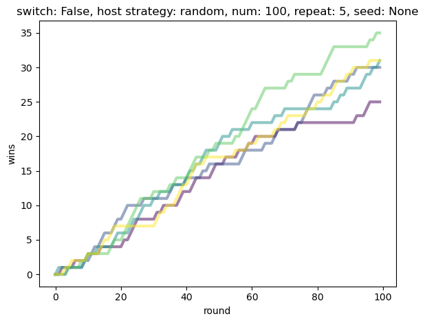
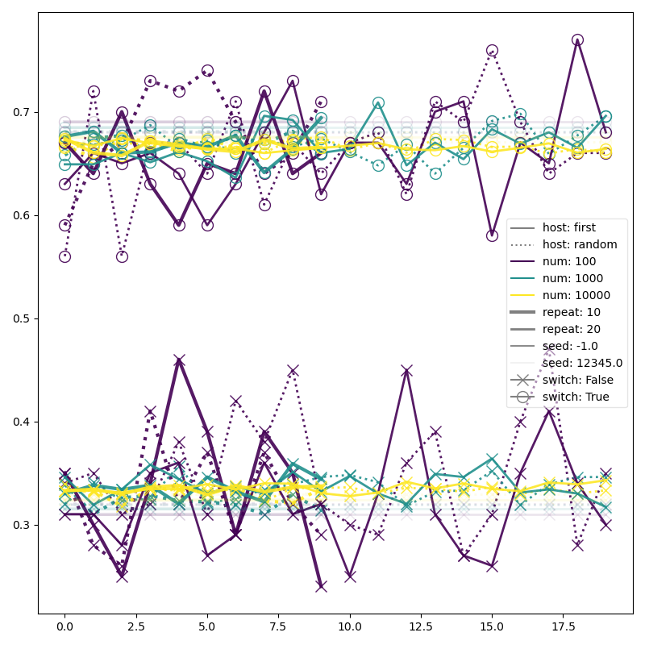

soops
=====

soops = scoop output of parametric studies

Utilities to run parametric studies in parallel using dask, and to scoop
the output files produced by the studies into a pandas dataframe.

.. contents::

Installation
------------

The latest release::

  pip install soops

The source code of the development version in git::

  git clone https://github.com/rc/soops.git
  cd soops
  pip install .

or the development version via pip::

  pip install git+https://github.com/rc/soops.git

Testing
-------

Install pytest::

  pip install pytest

Install `soops` from sources (in the current directory)::

  pip install .

Run the tests (in any directory)::

  python -c "import soops; soops.test()"

Run tests in the source directory without installing soops::

  export PYTHONPATH=.
  python -c "import soops; soops.test()"
  # or
  pytest soops/tests

Example
-------

Before we begin - TL;DR:

- Run a script in parallel with many combinations of parameters.
- Scoop all the results in many output directories into a big ``DataFrame``.
- Work with the ``DataFrame``.

A Script
''''''''

Suppose we have a script that takes a number of command line arguments. The
actual arguments are not so important, neither what the script does.
Nevertheless, to have something to work with, let us simulate the `Monty Hall
problem <https://en.wikipedia.org/wiki/Monty_Hall_problem>`_ in Python.

For the first reading of the example below, it is advisable not to delve in
details of the script outputs and code listings and just read the text to get
an overall idea. After understanding the idea, return to the details, or just
have a look at the `complete example script <soops/examples/monty_hall.py>`_.

This is our script and its arguments::

  $ python soops/examples/monty_hall.py -h
  usage: monty_hall.py [-h] [--switch] [--host {random,first}] [--num int]
                       [--repeat int] [--seed int] [--plot-opts dict-like] [-n]
                       [--silent]
                       output_dir

  The Monty Hall problem simulator parameterized with soops.

  https://en.wikipedia.org/wiki/Monty_Hall_problem

  <snip>

  positional arguments:
    output_dir            output directory

  options:
    -h, --help            show this help message and exit
    --switch              if given, the contestant always switches the door,
                          otherwise never switches
    --host {random,first}
                          the host strategy for opening doors
    --num int             the number of rounds in a single simulation [default:
                          100]
    --repeat int          the number of simulations [default: 5]
    --seed int            if given, the random seed is fixed to the given value
    --plot-opts dict-like
                          matplotlib plot() options [default:
                          "linewidth=3,alpha=0.5"]
    -n, --no-show         do not call matplotlib show()
    --silent              do not print messages to screen

Basic Run
'''''''''

A run with the default parameters::

  $ python soops/examples/monty_hall.py output
  monty_hall: num: 100
  monty_hall: repeat: 5
  monty_hall: switch: False
  monty_hall: host strategy: random
  monty_hall: elapsed: 0.004662119084969163
  monty_hall: win rate: 0.25
  monty_hall: elapsed: 0.0042096920078620315
  monty_hall: win rate: 0.3
  monty_hall: elapsed: 0.003894180990755558
  monty_hall: win rate: 0.31
  monty_hall: elapsed: 0.003928505931980908
  monty_hall: win rate: 0.35
  monty_hall: elapsed: 0.0035342529881745577
  monty_hall: win rate: 0.31

produces some results:

Parameterization
''''''''''''''''

Now we would like to run it for various combinations of arguments and their
values, for example:

- `--num=[100,1000,10000]`
- `--repeat=[10,20]`
- `--switch` either given or not
- `--seed` either given or not, changing together with `--seed`
- `--host=['random', 'first']`

and then collect and analyze the all results. Doing this manually is quite
tedious, but `soops` can help.

In order to run a parametric study, first we have to define a function
describing the arguments of our script:

.. code:: python

   def get_run_info():
       # script_dir is added by soops-run, it is the normalized path to
       # this script.
       run_cmd = """
       {python} {script_dir}/monty_hall.py {output_dir}
       """
       run_cmd = ' '.join(run_cmd.split())

       # Arguments allowed to be missing in soops-run calls.
       opt_args = {
           '--num' : '--num={--num}',
           '--repeat' : '--repeat={--repeat}',
           '--switch' : '--switch',
           '--host' : '--host={--host}',
           '--seed' : '--seed={--seed}',
           '--plot-opts' : '--plot-opts={--plot-opts}',
           '--no-show' : '--no-show',
           '--silent' : '--silent',
       }

       output_dir_key = 'output_dir'
       is_finished_basename = 'wins.png'

       return run_cmd, opt_args, output_dir_key, is_finished_basename

The `get_run_info()` functions should provide four items:

#. A command to run given as a string, with the non-optional arguments and
   their values (if any) given as ``str.format()`` keys.

#. A dictionary of optional arguments and their values (if any) given as
   ``str.format()`` keys.

#. A special format key, that denotes the output directory argument of the
   command. Note that the script must have an argument allowing an output
   directory specification.

#. A function ``is_finished(pars, options)``, where `pars` is the dictionary of
   the actual values of the script arguments and `options` are `soops-run`
   options, see below. The dictionary contains the output directory argument of
   the script and the function should return True, whenever the results are
   already present in the given output directory. Instead of a function, a file
   name can be given, as in `get_run_info()` above. Then the existence of a
   file with the specified name means that the results are present in the
   output directory.

Run Parametric Study
''''''''''''''''''''

Putting `get_run_info()` into our script allows running a parametric study using
`soops-run`::

  $ soops-run -h
  usage: soops-run [-h] [--dry-run] [-r {0,1,2}] [-n int]
                   [--run-function {subprocess.run,psutil.Popen,os.system}]
                   [-t float]
                   [--generate-pars dict-like: function=function_name,par0=val0,... or str]
                   [-c key1+key2+..., ...]
                   [--compute-pars dict-like: class=class_name,par0=val0,...]
                   [-s str] [--silent] [--shell] [-o path]
                   conf run_mod

  Run parametric studies.

  positional arguments:
    conf                  a dict-like parametric study configuration or a study
                          configuration file name
    run_mod               the importable script/module with get_run_info()

  options:
    -h, --help            show this help message and exit
    --dry-run             perform a trial run with no commands executed
    -r {0,1,2}, --recompute {0,1,2}
                          recomputation strategy: 0: do not recompute, 1:
                          recompute only if is_finished() returns False, 2:
                          always recompute [default: 1]
    -n int, --n-workers int
                          the number of dask workers [default: 2]
    --run-function {subprocess.run,psutil.Popen,os.system}
                          function for running the parameterized command
                          [default: subprocess.run]
    -t float, --timeout float
                          if given, the timeout in seconds; requires setting
                          --run-function=psutil.Popen
    --generate-pars dict-like: function=function_name,par0=val0,... or str
                          if given, generate values of parameters using the
                          specified function; the generated parameters must be
                          set to @generate in the parametric study
                          configuration. Alternatively, a section key in a study
                          configuration file.
    -c key1+key2+..., ..., --contract key1+key2+..., ...
                          list of option keys that should be contracted to vary
                          in lockstep
    --compute-pars dict-like: class=class_name,par0=val0,...
                          if given, compute additional parameters using the
                          specified class
    -s str, --study str   study key when parameter sets are given by a study
                          configuration file
    --silent              do not print messages to screen
    --shell               run ipython shell after all computations
    -o path, --output-dir path
                          output directory [default: output]

In our case (the arguments with no value (flags) can be specified either as
``'@defined'`` or ``'@undefined'``)::

  soops-run -r 1 -n 3 -c='--switch + --seed' -o output "python='python3', output_dir='output/study/%s', --num=[100,1000,10000], --repeat=[10,20], --switch=['@undefined', '@defined', '@undefined', '@defined'], --seed=['@undefined', '@undefined', 12345, 12345], --host=['random', 'first'], --silent=@defined, --no-show=@defined" soops/examples/monty_hall.py

This command runs our script using three dask workers (``-n 3`` option) and
produces a directory for each parameter set::

  $ ls output/study/
  000-7a6b546a625c2d37569346a286f2b2b6/  024-6f9810a492faf793b80de2ec32dec4b1/
  001-1daf48cede910a9c7c700fb78ce3aa2d/  025-a4d05c2889189c4e086f9d6f56e1ba1d/
  002-57c1271f4b9cbe00742e3c97e0c14e24/  026-67a251e1c40f65bae8bbf621c4e1a987/
  003-2f828633fa9eefa8eb8b40873882247d/  027-9e3d30603d2b382256f62fdf17bc23ae/
  004-24f370388496173d8e1d7a9e574262e0/  028-6ff18af0333367a65ed131d210078653/
  005-7893091a6fedc4ccdf7d73d803a91687/  029-54d77d99e74402a043af583ac1e14c4e/
  006-70132dc423f26c78f1d2e33f0607820c/  030-4bad1e59de5b446e80a621fdfb5fb127/
  007-7e5ecb11154e4c402caa51878e283e63/  031-d65b7afd4d43b3159b580cf6c974a26c/
  008-201e1ab3e47d3b994f2d6532859ac301/  032-cd83aafc620d81b994f005c6a7b1d2c4/
  009-35105e72d8ec2ddfd8adc8ffa8c1f088/  033-e065bfc2596f3b285877e36578d77cce/
  010-ff68ea026e0efba0e4c2a71d64e12f2c/  034-0533ff015142c967f86b365076fcee18/
  011-217e45abc1d2b188b0755fc6a550dfe9/  035-f127408b640dae1de6acc9bce1b68669/
  012-d6adcade17e2d7d843cbd8e14aebf76a/  036-56654b678decdd2d77ecc07ead326ad7/
  013-cdff71cb542f8159ff5c5a023c91f61c/  037-d3d16497570cb3f934e73c3f0c519822/
  014-551f32ba477c7e8e8fad0769ac793d3c/  038-5b3b21be9e6dbbd5c7d8e031bd621717/
  015-856ad0b4ee0273da8cd8ad3cf222077b/  039-d11e877087ec25fe2c8062708687204c/
  016-7eb991928b39b40c98e7cb7970d0f15b/  040-5cf056a63f2e10ee78d599e097eb4d0e/
  017-9a3f4b32f5ba30ec173dd651c9810c6e/  041-ca696dc0edbe70890f2dcbcfcf99fe47/
  018-9067a6dbbb4afaf285f5c9101fa5fa73/  042-9962ccd67846d21245580de2c5e83bcc/
  019-03a0123bd55725fdabec32e0aeff9d44/  043-18503a94bf6398644e2a32d3a93e9450/
  020-266ed9d092128d8e3c3c2f78669a0425/  044-6c46f7a9e9cd0b50d914d6e2a188a64d/
  021-00a156df6ccecab8d35c5bdc5ddb6c0e/  045-0af51ef33a80a99ac38bfbac10fea9b2/
  022-91f0d18a4d9cd2e6721d937c9de4dbe9/  046-746823fee6450a294869dc9ca7396e15/
  023-e3edef5a83fe941c75df4257ac056ca5/  047-f9046e62d8da3159dfcdebcf687092f3/

The directory names consist of an integer allowing an easy location and a MD5
hash of the run parameters. In each directory, there are four files::

  $ ls output/study/000-7a6b546a625c2d37569346a286f2b2b6/
  options.txt  output_log.txt  soops-parameters.csv  wins.png

three just like in the basic run above, and `soops-parameters.csv`, where the
run parameters (mostly command line arguments) are stored by `soops-run`. For
convenience, parameters of all runs are collected in `all_parameters.csv` in the
`soops-run` output directory (`output` by default), using the data in all
`soops-parameters.csv` files found.

Our example script also stores the values of command line arguments in
``options.txt`` for possible re-runs and inspection::

  $ cat output/study/000-7a6b546a625c2d37569346a286f2b2b6/options.txt

  command line
  ------------

  "soops/examples/monty_hall.py" "output/study/000-7a6b546a625c2d37569346a286f2b2b6" "--num=100" "--repeat=10" "--host=random" "--no-show" "--silent"

  options
  -------

  host: random
  num: 100
  output_dir: output/study/000-7a6b546a625c2d37569346a286f2b2b6
  plot_opts: {'linewidth': 3, 'alpha': 0.5}
  repeat: 10
  seed: None
  show: False
  silent: True
  switch: False

Using Parametric Study Configuration Files
''''''''''''''''''''''''''''''''''''''''''

Instead of providing the parameter sets on the command line, a study
configuration file can be used. Then the same parametric study as above
can be run using::

  soops-run -r 1 -n 3 -c='--switch + --seed' --study=study -o output soops/examples/studies.cfg soops/examples/monty_hall.py

where ``soops/examples/studies.cfg`` contains::

  [study]
  python='python3'
  output_dir='output/study/%s'
  --num=[100,1000,10000]
  --repeat=[10,20]
  --switch=['@undefined', '@defined', '@undefined', '@defined']
  --seed=['@undefined', '@undefined', 12345, 12345]
  --host=['random', 'first']
  --silent=@defined
  --no-show=@defined

Several studies can be stored in a single file, see `soops/examples/studies.cfg
<soops/examples/studies.cfg>`_. See also the docstring of
`soops/examples/monty_hall.py <soops/examples/monty_hall.py>`_ for more
examples.

Show Parameters Used in Each Output Directory
'''''''''''''''''''''''''''''''''''''''''''''

Use ``soops-info`` to explain which parameters were used in the given output
directories::

  $ soops-info -h
  usage: soops-info [-h] [-e dirname [dirname ...]] [--shell] run_mod

  Get parametric study configuration information.

  positional arguments:
    run_mod               the importable script/module with get_run_info()

  optional arguments:
    -h, --help            show this help message and exit
    -e dirname [dirname ...], --explain dirname [dirname ...]
                          explain parameters used in the given output
                          directory/directories
    --shell               run ipython shell after all computations

::

  $ soops-info soops/examples/monty_hall.py -e output/study/000-7a6b546a625c2d37569346a286f2b2b6/
  info: output/study/000-7a6b546a625c2d37569346a286f2b2b6/
  info:      finished: True
  info: *      --host: random
  info: *   --no-show: @defined
  info: *       --num: 100
  info: * --plot-opts: @undefined
  info: *    --repeat: 10
  info: *      --seed: @undefined
  info: *    --silent: @defined
  info: *    --switch: @undefined
  info: *      python: python3
  info:    output_dir: output/study/000-7a6b546a625c2d37569346a286f2b2b6
  info:    script_dir: examples

A `*` denotes a parameter used in the parameterization of the example script,
other parameters are employed by `soops-run`.

Scoop Outputs of the Parametric Study
'''''''''''''''''''''''''''''''''''''

In order to use ``soops-scoop`` to scoop/collect outputs of our parametric
study, a new function needs to be defined:

.. code:: python

   import soops.scoop_outputs as sc

   def get_scoop_info():
       info = [
           ('options.txt', partial(
               sc.load_split_options,
               split_keys=None,
           ), True),
           ('output_log.txt', scrape_output),
       ]

       return info

The function for loading the ``'options.txt'`` files is already in `soops`. The
third item in the tuple, if present and True, denotes that the output contains
input parameters that were used for the parameterization. This allows getting
the parameterization in post-processing plugins, see below
the ``plot_win_rates()`` function.

The function to get useful information from ``'output_log.txt'`` needs to be
provided:

.. code:: python

   def scrape_output(filename, rdata=None):
       out = {}
       with open(filename, 'r') as fd:
           repeat = rdata['repeat']
           for ii in range(4):
               next(fd)

           elapsed = []
           win_rate = []
           for ii in range(repeat):
               line = next(fd).split()
               elapsed.append(float(line[-1]))
               line = next(fd).split()
               win_rate.append(float(line[-1]))

           out['elapsed'] = np.array(elapsed)
           out['win_rate'] = np.array(win_rate)

       return out

Then we are ready to run ``soops-scoop``::

  $ soops-scoop -h
  usage: soops-scoop [-h] [-s column[,column,...]]
                     [--filter filename[,filename,...]] [--no-plugins]
                     [--use-plugins name[,name,...] | --omit-plugins
                     name[,name,...]] [-p module] [--plugin-args dict-like]
                     [--results filename] [--no-csv] [-r] [--write] [--shell]
                     [--debug] [-o path]
                     scoop_mod directories [directories ...]

  Scoop output files.

  positional arguments:
    scoop_mod             the importable script/module with get_scoop_info()
    directories           results directories. On "Argument list too long"
                          system error, enclose the directories matching pattern
                          in "", it will be expanded using glob.glob().

  options:
    -h, --help            show this help message and exit
    -s column[,column,...], --sort column[,column,...]
                          column keys for sorting of DataFrame rows
    --filter filename[,filename,...]
                          use only DataFrame rows with given files successfully
                          scooped
    --no-plugins          do not call post-processing plugins
    --use-plugins name[,name,...]
                          use only the named plugins (no effect with --no-
                          plugins)
    --omit-plugins name[,name,...]
                          omit the named plugins (no effect with --no-plugins)
    -p module, --plugin-mod module
                          if given, the module that has get_plugin_info()
                          instead of scoop_mod
    --plugin-args dict-like
                          optional arguments passed to plugins given as
                          plugin_name={key1=val1, key2=val2, ...}, ...
    --results filename    results file name [default: <output_dir>/results.h5]
    --no-csv              do not save results as CSV (use only HDF5)
    -r, --reuse           reuse previously scooped results file
    --write               write results files even when results were loaded
                          using --reuse option
    --shell               run ipython shell after all computations
    --debug               automatically start debugger when an exception is
                          raised
    -o path, --output-dir path
                          output directory [default: .]

as follows::

  $ soops-scoop soops/examples/monty_hall.py output/study/ -s rdir -o output/study --no-plugins --shell

  <snip>

  Python 3.7.3 | packaged by conda-forge | (default, Jul  1 2019, 21:52:21)
  Type 'copyright', 'credits' or 'license' for more information
  IPython 7.13.0 -- An enhanced Interactive Python. Type '?' for help.

  In [1]: df.keys()
  Out[1]:
  Index(['rdir', 'rfiles', 'host', 'num', 'output_dir', 'plot_opts', 'repeat',
         'seed', 'show', 'silent', 'switch', 'elapsed', 'win_rate', 'time'],
        dtype='object')

  In [2]: df.win_rate.head()
  Out[2]:
  0    [0.32, 0.4, 0.38, 0.27, 0.31, 0.39, 0.25, 0.33...
  1    [0.64, 0.67, 0.68, 0.67, 0.73, 0.62, 0.66, 0.7...
  2    [0.32, 0.32, 0.32, 0.32, 0.32, 0.32, 0.32, 0.3...
  3    [0.68, 0.68, 0.68, 0.68, 0.68, 0.68, 0.68, 0.6...
  4    [0.28, 0.28, 0.35, 0.32, 0.29, 0.33, 0.29, 0.3...
  Name: win_rate, dtype: object

  In [3]: df.iloc[0]
  Out[3]:
  rdir          ~/projects/soops/output/study/000-7a6b546a625c...
  rfiles                            [options.txt, output_log.txt]
  host                                                     random
  num                                                         100
  output_dir    output/study/000-7a6b546a625c2d37569346a286f2b2b6
  plot_opts                        {'linewidth': 3, 'alpha': 0.5}
  repeat                                                       10
  seed                                                        NaN
  show                                                      False
  silent                                                     True
  switch                                                    False
  elapsed       [0.0031552709988318384, 0.0032349379907827824,...
  win_rate      [0.32, 0.4, 0.38, 0.27, 0.31, 0.39, 0.25, 0.33...
  time                                 2021-02-07 14:34:30.202971
  Name: 0, dtype: object

The ``DataFrame`` with the all results is saved in ``output/study/results.h5``
for reuse.

Post-processing Plugins
'''''''''''''''''''''''

It is also possible to define simple plugins that act on the resulting
``DataFrame``. First, define a function that will register the plugins:

.. code:: python

   def get_plugin_info():
       from soops.plugins import show_figures

       info = [plot_win_rates, show_figures]

       return info

The ``show_figures()`` plugin is defined in `soops`. The ``plot_win_rates()``
plugin allows plotting the all results combined:

.. code:: python

   def plot_win_rates(df, data=None, colormap_name='viridis'):
       import soops.plot_selected as sps

       df = df.copy()
       df['seed'] = df['seed'].where(df['seed'].notnull(), -1)

       uniques = sc.get_uniques(df, [key for key in data.multi_par_keys
                                     if key not in ['output_dir']])
       output('parameterization:')
       for key, val in uniques.items():
           output(key, val)

       selected = sps.normalize_selected(uniques)

       styles = {key : {} for key in selected.keys()}
       styles['seed'] = {'alpha' : [0.9, 0.1]}
       styles['num'] = {'color' : colormap_name}
       styles['repeat'] = {'lw' : np.linspace(3, 2,
                                              len(selected.get('repeat', [1])))}
       styles['host'] = {'ls' : ['-', ':']}
       styles['switch'] = {'marker' : ['x', 'o'], 'mfc' : 'None', 'ms' : 10}

       styles = sps.setup_plot_styles(selected, styles)

       fig, ax = plt.subplots(figsize=(8, 8))
       sps.plot_selected(ax, df, 'win_rate', selected, {}, styles)
       ax.set_xlabel('simulation number')
       ax.set_ylabel('win rate')
       fig.tight_layout()
       fig.savefig(os.path.join(data.output_dir, 'win_rates.png'))

       return data

Then, running::

  soops-scoop soops/examples/monty_hall.py output/study/ -s rdir -o output/study -r

reuses the ``output/study/results.h5`` file and plots the combined results:

It is possible to pass arguments to plugins using ``--plugin-args`` option, as
follows::

  soops-scoop soops/examples/monty_hall.py output/study/ -s rdir -o output/study -r --plugin-args=plot_win_rates={colormap_name='plasma'}

Notes
'''''

- The `get_run_info()`, `get_scoop_info()` and `get_plugin_info()` info
  function can be in different modules.
- The script that is being parameterized need not be a Python module - any
  executable which can be run from a command line can be used.

Special Argument Values
'''''''''''''''''''''''

- ``'@defined'`` denotes that a value-less argument is present.
- ``'@undefined'`` denotes that a value-less argument is not present.
- ``'@arange([start,] stop[, step,], dtype=None)'`` denotes values obtained by
  calling ``numpy.arange()`` with the given arguments.
- ``'@linspace(start, stop, num=50, endpoint=True, dtype=None, axis=0)'``
  denotes values obtained by calling ``numpy.linspace()`` with the given
  arguments.
- ``'@generate'`` denotes an argument whose values are generated, in connection
  with ``--generate-pars`` option, see below.

Generated Arguments
'''''''''''''''''''

Argument sequences can be generated using a function with the help of
``--generate-pars`` option. For example, the same results as above can be
achieved by defining a function that generates ``--switch`` and ``--seed``
arguments values:

.. code:: python

   def generate_seed_switch(args, gkeys, dconf, options):
       """
       Parameters
       ----------
       args : Struct
           The arguments passed from the command line.
       gkeys : list
           The list of option keys to generate.
       dconf : dict
           The parsed parameters of the parametric study.
       options : Namespace
           The soops-run command line options.
       """
       seeds, switches = zip(*product(args.seeds, args.switches))
       gconf = {'--seed' : list(seeds), '--switch' : list(switches)}
       return gconf

and then calling `soops-run` as follows::

  soops-run -r 1 -n 3 -c='--switch + --seed' -o output/study2 "python='python3', output_dir='output/study2/%s', --num=[100,1000,10000], --repeat=[10,20], --switch=@generate, --seed=@generate, --host=['random', 'first'], --silent=@defined, --no-show=@defined" --generate-pars="function=generate_seed_switch, seeds=['@undefined', 12345], switches=['@undefined', '@defined']" soops/examples/monty_hall.py

Notice the special ``@generate`` values of ``--switch`` and ``--seed``, and the
use of ``--generate-pars``: all key-value pairs, except the function name, are
passed into :func:``generate_seed_switch()`` in the ``args`` dict-like
argument.

The combined results can again be plotted using::

  soops-scoop soops/examples/monty_hall.py output/study2/0* -s rdir -o output/study2/

Computed Arguments
''''''''''''''''''

By using ``--compute-pars`` option it is possible to define arguments depending
on other arguments values in a more general way than with ``--contract``.
A callable class needs to be provided with the following structure:

.. code:: python

   class ComputePars:

       def __init__(self, args, par_seqs, key_order, options):
           """
           Called prior to the parametric study to pre-compute reusable data.
           """
           pass

       def __call__(self, all_pars):
           """
           Called for each parameter set of the study.
           """
           out = {}
           return out

Find Runs with Given Parameters
'''''''''''''''''''''''''''''''

For very large parametric studies, it might be impractical to view
`all_parameters.csv` directly when searching a directory of a run with given
parameters. The `soops-find` script can be used instead::

  $ soops-find -h
  usage: soops-find [-h] [-q pandas-query-expression]
                    [--engine {numexpr,python}] [--shell]
                    directories [directories ...]

  Find parametric studies with parameters satisfying a given query.

  Option-like parameters are transformed to valid Python attribute names removing
  initial dashes and replacing other dashes by underscores. For example
  '--output-dir' becomes 'output_dir'.

  positional arguments:
    directories           one or more root directories with sub-directories
                          containing parametric study results

  options:
    -h, --help            show this help message and exit
    -q pandas-query-expression, --query pandas-query-expression
                          pandas query expression applied to collected
                          parameters
    --engine {numexpr,python}
                          pandas query evaluation engine [default: numexpr]
    --shell               run ipython shell after all computations

Without options, it loads all parameter sets found in given directories into
a DataFrame and launches the ipython shell::

  $ soops-find output/study
  find: 48 parameter sets stored in `apdf` DataFrame
  find: column names:
  Index(['finished', 'host', 'no_show', 'num', 'plot_opts', 'repeat', 'seed',
         'silent', 'switch', 'python', 'output_dir', 'script_dir'],
        dtype='object')
  Python 3.8.5 (default, Sep  4 2020, 07:30:14)
  Type 'copyright', 'credits' or 'license' for more information
  IPython 7.21.0 -- An enhanced Interactive Python. Type '?' for help.

  In [1]:

The ``--query`` option can be used to limit the search, for example::

  $ soops-find output/study -q "num==1000 & repeat==20 & seed==12345"

See Also
--------

- `automan <https://github.com/pypr/automan>`_
